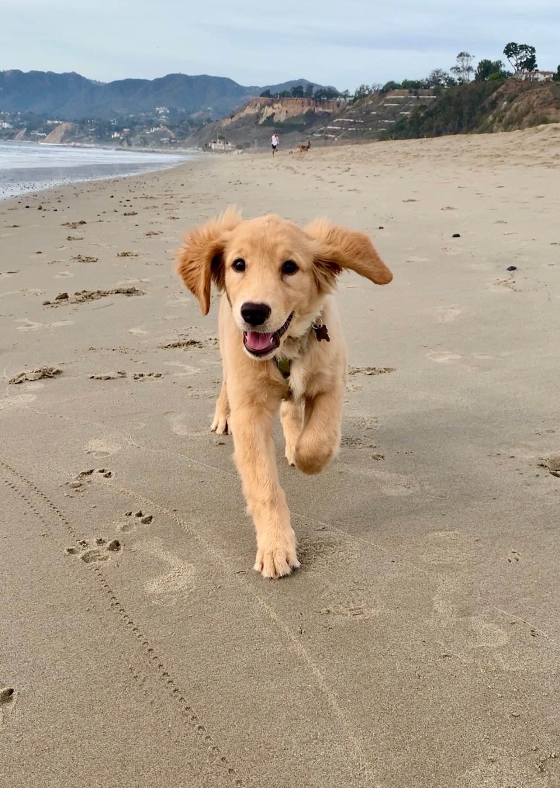
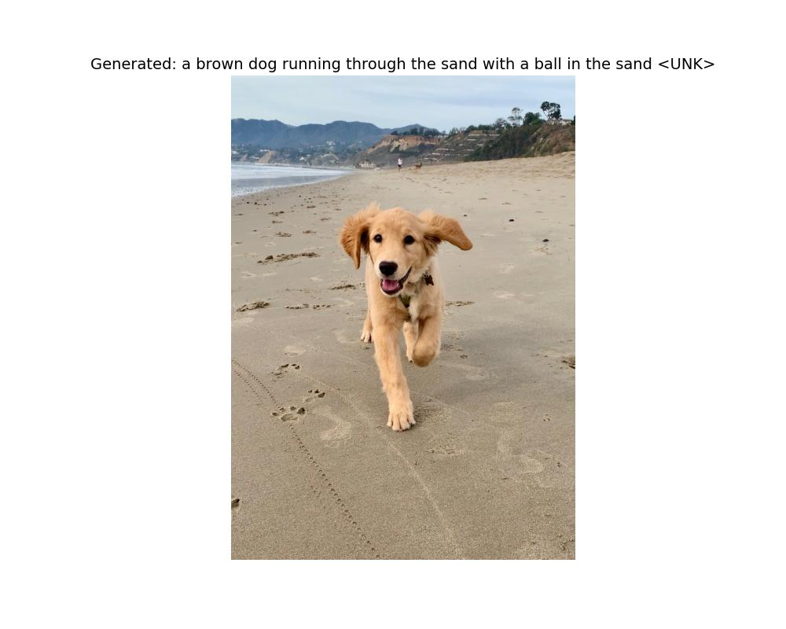

# Image Captioning with Attention

This project implements an **Image Captioning** model using an Encoder-Decoder architecture with an Attention Mechanism.


## 📝 Description

The model combines:
*   **Encoder:** A pre-trained **ResNet50** CNN (features extracted before classification) to encode the image.
*   **Decoder:** An **LSTM** RNN with an **Attention Mechanism** (Soft Attention) to generate the description word by word, focusing on different parts of the image at each step.
*   **Embeddings:** Initialized with **Word2Vec** (Google News) for better semantic representation.

The dataset used is **Flickr30k**.

## 📂 Project Structure

```
.
├── TP_attention.ipynb   # Jupyter Notebook (model definition and training loop)
├── test.py              # Inference script to test the model on new images
├── report.pdf           # Detailed project report (13 pages)
├── report.tex           # LaTeX source of the report
├── best_model.pth       # Checkpoint of the best trained model
├── images/              # Images used for the report and testing
├── output_examples/     # Generated results
└── model_parts/         # Split parts of the trained model (GitHub size limit workaround)
```

## 🚀 Usage

### ⚠️ Model Reassembly (Important)
Since the model file is large (>100MB), it is split into parts in `model_parts/`.
**Ideally, the `test.py` script will automatically reassemble it for you.**

However, if you want to manually reassemble it (e.g., for training):
```bash
cat model_parts/best_model.pth.part_* > best_model.pth
```

### Prerequisites
Ensure you have installed the necessary dependencies:
```bash
pip install torch torchvision numpy pandas matplotlib pillow tqdm
```

### 1. Training
To start training the model (or resume the workflow):
```bash
# Open the notebook and run all cells
jupyter notebook TP_attention.ipynb
```
*Note: The script automatically downloads the Flickr30k dataset and Word2Vec vectors if needed.*

### 2. Inference (Test)
To generate a caption for a custom image, use the `test.py` script:

```bash
python test.py path/to/your/image.jpg
```

Exemple:
```bash
python test.py images/test_image.jpg
```
The image with the generated caption will be saved in the `output_examples` folder.

## 🖼️ Example

Here is a demonstration of the model's capability:

| Input Image | Generated Output |
|:-----------:|:----------------:|
|  |  |
| *Original Image* | *Model Prediction: "a brown dog running..."* |

## 📄 Report
A comprehensive report detailing the architecture, theoretical choices (ResNet, LSTM, Attention), and results analysis is available in **[report.pdf](report.pdf)** (in French).

## 📊 Results
The model learns to align image regions with generated words.
Result example: "a brown dog running on the sand".

---
*Project realized as part of the Master's program, ENSAJ.*
